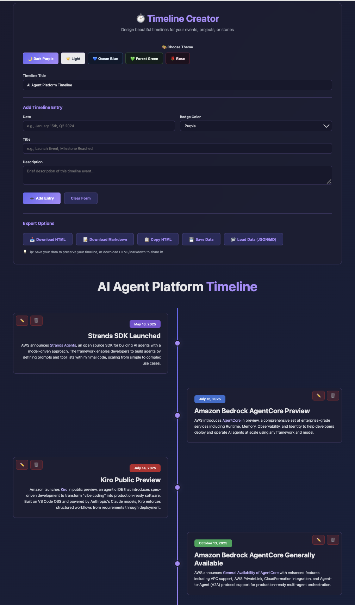
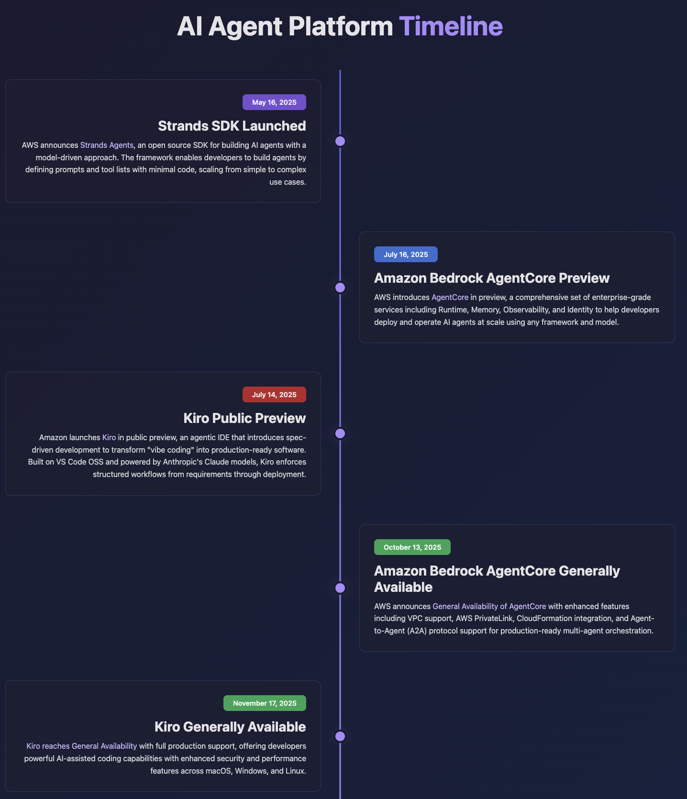

# Timeline Creator

A beautiful, interactive web application for creating and visualizing timelines. Create chronological event timelines with rich descriptions, customizable colors, and multiple export formats - all in your browser.

**Live App:** https://nathanielng.github.io/timeline/

**Original Demo:** https://claude.ai/public/artifacts/360d6611-6e40-4de6-bddd-cfd82edc6b2c

## Features

- **Visual Timeline Editor** - Create and edit timeline entries with an intuitive interface
- **Rich Content Support** - Add titles, dates, descriptions with Markdown links
- **Customizable Styling** - Choose from multiple color themes and badge colors for each entry
- **Multiple Export Formats** - Export to HTML, JSON, or Markdown
- **Import/Export** - Save your work as JSON and reload it later
- **Responsive Design** - Works seamlessly on desktop and mobile devices
- **No Installation Required** - Runs entirely in your browser

## Getting Started

### Using the Application

1. **Open the App**: Visit the [live app](https://nathanielng.github.io/timeline/) or open `src/timeline-creator.html` in your web browser

2. **Set Your Timeline Title**: Enter a title for your timeline in the top input field

3. **Add Timeline Entries**: Click "Add Entry" and fill in:
   - **Title**: The name of the event
   - **Date**: When the event occurred (e.g., "May 16, 2025")
   - **Description**: Details about the event (supports Markdown links)
   - **Badge Color**: Choose a color to categorize the entry (purple, blue, red, green, etc.)

4. **Customize Theme**: Select a color theme from the dropdown (Dark, Light, Blue, Green, Rose)

5. **Export Your Timeline**: Click one of the export buttons:
   - **Export HTML**: Get a standalone HTML file with your timeline
   - **Export JSON**: Save your timeline data for later editing
   - **Export Markdown**: Get a Markdown-formatted version

### Loading an Existing Timeline

1. Click the **"Import JSON"** button
2. Paste your timeline JSON data
3. Click "Import" to load the timeline

## Timeline JSON Format

Timelines are stored as JSON with the following structure:

```json
{
  "title": "Your Timeline Title",
  "theme": "dark",
  "entries": [
    {
      "title": "Event Title",
      "date": "May 16, 2025",
      "description": "Event description with [links](https://example.com)",
      "badgeColor": "purple"
    }
  ]
}
```

**Available Badge Colors**: purple, blue, red, green, orange, yellow, pink, gray

**Available Themes**: dark, light, blue, green, rose

## Example

Check out the `samples/` directory for a complete example:
- `timeline.json` - Sample timeline data (AI Agent Platform events)
- `timeline.html` - Exported HTML version
- `timeline.md` - Exported Markdown version

## Screenshots

### Timeline Editor

*The interactive editor interface with theme selection and entry management*

### Exported HTML View

*A beautifully rendered timeline ready to share or embed*

## Use Cases

- **Project Roadmaps**: Visualize project milestones and deliverables
- **Company History**: Document key events in your organization's journey
- **Product Launches**: Track product development and release history
- **Personal Achievements**: Create a visual CV or portfolio timeline
- **Historical Events**: Educational timelines for any subject
- **Event Planning**: Plan and visualize event schedules

## Technical Details

- Built with vanilla HTML, CSS, and JavaScript
- No external dependencies required
- Fully client-side application
- Works offline once loaded

## License

Created by Claude AI.
